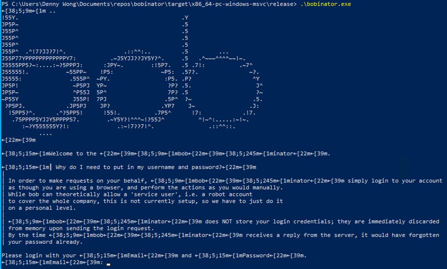

# BOBinator
## your helper utility to automate BOB


> ## Documentation available
> ...at [Github Pages](https://denwong47.github.io/bobinator/bobinator/).

# What does this do?

BOBinator is a secure command line utility to help you automate some of your operations on [Bob](https://app.hibob.com/) the HR management platform.

# Why do we need this?

Honestly you don't.

This is tailored only for the company I work for, where we are allowed a friday off every fortnight. However you are supposed to book your Friday Off on Bob manually, and the interface is a bit cumbersome at best.

This utility is just an agent to help you block book your Fridays Off in our specific circumstances.

This won't be very useful outside of our company.

## Ok I am your colleague and I need to book some Friday Offs.

Sure, all you need to do is head to [`releases`](https://github.com/denwong47/bobinator/releases), find the latest version, and download the relevant binary from the **Assets** session. Windows, Intel Mac, Apple M1 Mac and Linux x86 are supported.

Unzip the file and you should be left with one file - all you need to do is execute it.

# It's asking me to enter my password. Are you stealing my data?

## The short answer is:
No, BOBinator is very forgetful and will forget everything you entered in the earliest possible opportunity.

## The long answer is:
BOBinator is only doing everything as though you would in your browser. It has no special handshake agreement with BOB, and thus it needs to send the same user name and password as you would on their website. It pretends to be a Firefox browser, and use the same encryption standards as the browser would.

While BOB supports service accounts, they are meant to be set up company wide, which we don't have at the moment, so we will have to resort to personal credentials.

While BOBinator is made mainly for a laugh, we take security and privacy very seriously and it was written with this with this as the primary consideration:

- The app is open source; you can read it to understand whether it is hiding secrets.
- The app is written in Rust, which is a memory safe language. Without unsafe code, this app is extremely unlikely to be exposing your password to any kind of memory sniffing/overflowing shenanigans.
- [This](src/app/login.rs#L55) is where the app asks you for password, the **full ownership** of which is then immediately handed over to the [login](src/bob/cookies/login.rs#L10) function. The function then creates the login request to send, and before it even sends it, [removes](src/bob/cookies/login.rs#L23) the username and password from its memory entirely. Once the request is sent, your username and password cease to exist inside the app entirely.

# Your app is full of undecipherable `[38;5;9m` and `[22m[39;m`.



You must be running this on Windows.

Pre-version 1909, Windows for some reason disables ANSI colours in the terminal even though it fully supports it. To enable this, you will need to set the registry key of:

```ini
[HKEY_CURRENT_USER\Console]
"VirtualTerminalLevel"=dword:00000001
```

Then you will be able to see the terminal in full colours.

Windows 11 users should not be affected.
